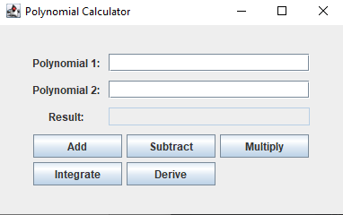

# Polynomial Calculator

## Descriere
Această aplicație permite efectuarea operațiilor matematice pe polinoame cu coeficienți întregi, folosind o interfață grafică intuitivă. Utilizatorul poate introduce două polinoame și poate efectua următoarele operații:
- **Adunare**
- **Scădere**
- **Înmulțire**
- **Împărțire**
- **Derivare**
- **Integrare**

Rezultatele sunt afișate direct pe interfață.  

## Screenshot
  

## Structura Proiectului

### 1. **Interfața Grafică**
- `PolynomialCalculator` – clasa principală care extinde `JFrame` și gestionează interfața.
- **Elemente UI**:
  - `poly1Field`, `poly2Field`, `resultField` – câmpuri pentru introducerea polinoamelor și afișarea rezultatului.
  - `addButton`, `subtractButton`, `multipButton`, `integrationButton`, `derivativeButton` – butoane pentru alegerea operației.
- `actionPerformed(ActionEvent e)` – gestionează evenimentele butoanelor și apelează metodele corespunzătoare.

### 2. **Algoritmi Matematici**
- `Operatii` – implementează operațiile matematice asupra polinoamelor.
- `simplifyPolynomial()` – rescrie monoamele pentru o afișare mai clară.
- `Polynom` – utilizează `HashMap` pentru stocarea coeficienților și exponenților.
- `Parse` – folosește regex pentru a împărți polinoamele în monoame.

### 3. **Testare**
- `PolynomialCalculatorTest` – conține teste pentru verificarea corectitudinii operațiilor.
